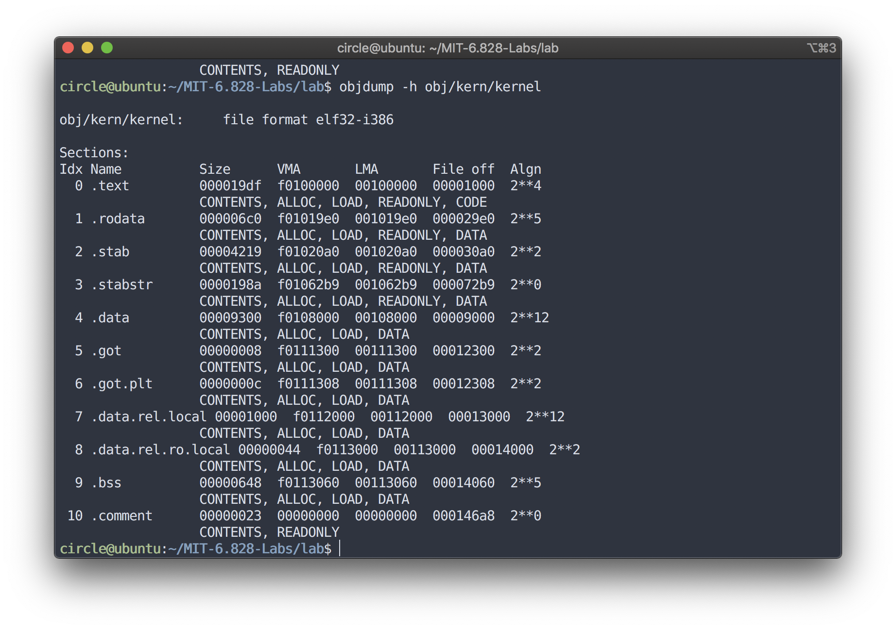
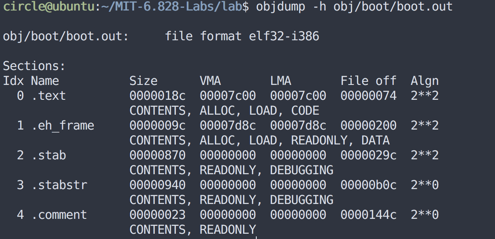
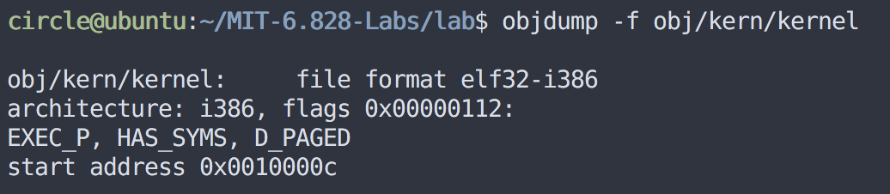
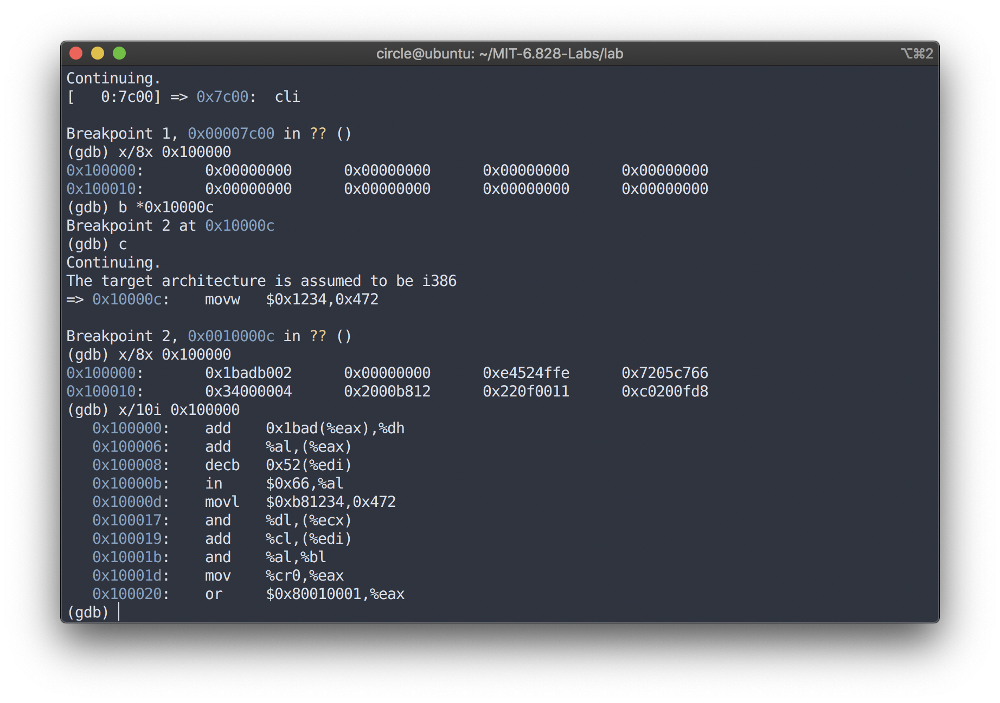
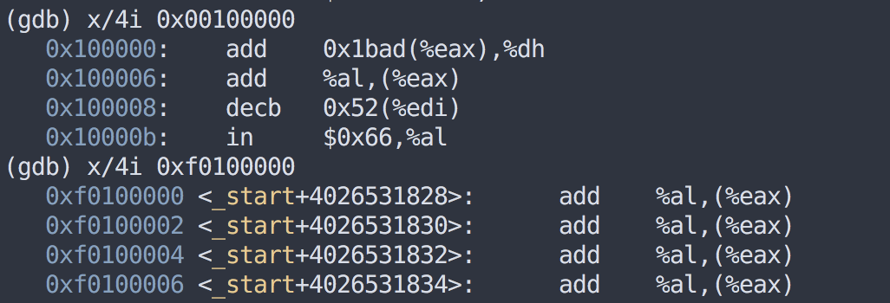
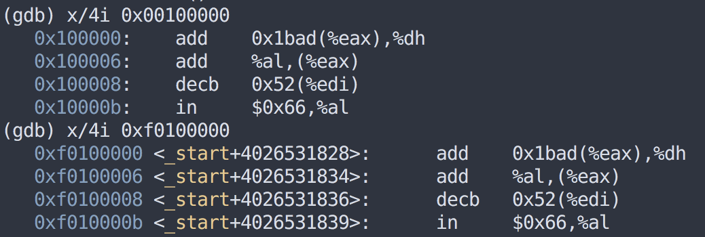

#Lab 1: Booting a PC

## 运行起来

1. 首先先把仓库拉下来

   ```bash
   git clone https://pdos.csail.mit.edu/6.828/2018/jos.git lab
   ```

2. 然后编译

   ```bash
   cd lab
   make
   ```

## Part 1: PC Bootstrap

### Getting Started with x86 assembly

这一部分主要是熟悉汇编语言


### Simulating the x86
使用下面命令运行，就不会弹出一个单独的命令行界面，也不会隐藏鼠标，而是直接在本地Terminal中显示
```bash
make qemu-nox
```

### PC物理地址空间

早期基于16位Intel 8088处理器只能操作1MB物理内存，因此物理地址空间起始于0x00000000到0x000FFFFF，其中640KB为 Low memory，这只能被随机存储器(RAM)使用。

从 0x000A0000 到 0x000FFFFF 的384KB留着给特殊使用，例如作为视频显示缓存或者储存在非易失存储器的硬件。从 0x000F0000 到 0x000FFFFF 占据64KB区域的部分是最重要的BIOS。BIOS的功能这里就不细说了。

现在的x86处理器支持超过4GB的物理RAM，所以RAM扩展到了0xFFFFFFFF。当然，BIOS也流出了开始的32位寻址空间为了让32位的设备映射。JOS这里只用开始的256MB，所以假设PC只有32位地址空间。

### BIOS

在一个终端中输入 `make qemu-gdb` ， 另一个终端输入 `make gdb` 。开始调试程序。

```
[f000:fff0] 0xffff0: ljmp $0xf000,$0xe05b
```

是GDB反汇编出的第一条执行指令，这条指令表面了：

- IBM PC 执行的起始物理地址为 0x000ffff0
- PC 的偏移方式为 CS = 0xf000，IP = 0xfff0
- 第一条指令执行的是 jmp指令，跳转到段地址 CS = 0xf000，IP = 0xe05b

QEMU模拟了8088处理器的启动，当启动电源，BIOS最先控制机器，这时还没有其他程序执行，之后处理器进入实模式也就是设置 CS 为 0xf000，IP 为 0xfff0。在启动电源也就是实模式时，地址转译根据这个公式工作：物理地址 = 16 * 段地址 + 偏移量。所以 PC 中 CS 为 0xf000 IP 为 0xfff0 的物理地址为：

```
   16 * 0xf000 + 0xfff0   # 十六进制中乘16很容易
   = 0xf0000 + 0xfff0     # 仅仅添加一个0.
   = 0xffff0
```

关于实模式，参考[CPU的实模式和保护模式(一)](https://zhuanlan.zhihu.com/p/42309472):

> 实模式出现于早期8088CPU时期。当时由于CPU的性能有限，一共只有20位地址线（所以地址空间只有1MB），以及8个16位的通用寄存器，以及4个16位的段寄存器。所以为了能够通过这些16位的寄存器去构成20位的主存地址，必须采取一种特殊的方式。当某个指令想要访问某个内存地址时，它通常需要用下面的这种格式来表示：
>
> 　　(段基址：段偏移量)
>
> 　 其中第一个字段是段基址，它的值是由**段寄存器**提供的(一般来说，段寄存器有6种，分别为cs，ds，ss，es，fs，gs，这几种段寄存器都有自己的特殊意义，这里不做介绍)。
>
> 　 第二字段是段内偏移量，代表你要访问的这个内存地址距离这个段基址的偏移。它的值就是由通用寄存器来提供的，所以也是16位。那么两个16位的值如何组合成一个20位的地址呢？CPU采用的方式是把段寄存器所提供的段基址先向左移4位。这样就变成了一个20位的值，然后再与段偏移量相加。
>
> 即：
>
> 　　物理地址 = 段基址<<4 + 段内偏移
>
> 　　所以假设段寄存器中的值是0xff00，段偏移量为0x0110。则这个地址对应的真实物理地址是 0xff00<<4 + 0x0110 = 0xff110。
>
> 由上面的介绍可见，实模式的"实"更多地体现在其地址是真实的物理地址。

0xffff0 在 BIOS (0x100000) 的结束地址之前。

当BIOS启动，它设置了一个中断描述符表并初始化多个设备比如VGA显示器。在初始化PCI总线和所有重要的设备之后，它寻找可引导的设备，之后读取 *boot loader* 并转移控制。

## Part 2: The Boot Loader

接下来是512 byte区域的扇区，它是硬盘最小调度单位，每次读或写操作都至少是一个扇区，并且还会进行对齐。BIOS加载引导扇区到内存中是从物理地址0x7c00到0x7dff，然后使用jmp指令设置 CS:IP 为 0000:7c00。因此 boot loader 不能超过512字节，它执行两个功能：

1. boot loader 切换处理器从实模式到保护模式，只有这样才能访问大于1MB的物理地址空间。
2. boot loader 从硬盘中读取内核。

### 加载Boot

#### Exercise 3

> 设置一个断点在地址0x7c00处，这是boot sector被加载的位置。然后让程序继续运行直到这个断点。跟踪/boot/boot.S文件的每一条指令，同时使用boot.S文件和系统为你反汇编出来的文件obj/boot/boot.asm。你也可以使用GDB的x/i指令来获取去任意一个机器指令的反汇编指令，把源文件boot.S文件和boot.asm文件以及在GDB反汇编出来的指令进行比较。
>
> 追踪到bootmain函数中，而且还要具体追踪到readsect()子函数里面。找出和readsect()c语言程序的每一条语句所对应的汇编指令，回到bootmain()，然后找出把内核文件从磁盘读取到内存的那个for循环所对应的汇编语句。找出当循环结束后会执行哪条语句，在那里设置断点，继续运行到断点，然后运行完所有的剩下的语句。

通过 `b *0x7c00` 设置断点，接着 `c` 运行到断点处，使用 `x/i` 来查看当前的指令。

首先查看boot.S文件，在开头可以看到

```assembly
start:
  .code16                     # Assemble for 16-bit mode
  cli                         # Disable interrupts
  cld                         # String operations increment
```

`.code16`伪指令，声明以下为16位指令

`cld` 是串操作指令，用来操作方向标志位DF，使DF=0。

> CLD指令功能：
> 将[标志寄存器](https://www.baidu.com/s?wd=标志寄存器&tn=SE_PcZhidaonwhc_ngpagmjz&rsv_dl=gh_pc_zhidao)Flag的方向标志位DF清零。
> 在字串操作中使[变址寄存器](https://www.baidu.com/s?wd=变址寄存器&tn=SE_PcZhidaonwhc_ngpagmjz&rsv_dl=gh_pc_zhidao)SI或DI的地址指针自动增加，字串处理由前往后。

```assembly
  # Set up the important data segment registers (DS, ES, SS).
  xorw    %ax,%ax             # Segment number zero
  movw    %ax,%ds             # -> Data Segment
  movw    %ax,%es             # -> Extra Segment
  movw    %ax,%ss             # -> Stack Segment
```

先将ax寄存器清零，然后将ds, es, ss寄存器清零

```assembly
  # Enable A20:
  #   For backwards compatibility with the earliest PCs, physical
  #   address line 20 is tied low, so that addresses higher than
  #   1MB wrap around to zero by default.  This code undoes this.
seta20.1:
  inb     $0x64,%al               # Wait for not busy
  testb   $0x2,%al
  jnz     seta20.1

  movb    $0xd1,%al               # 0xd1 -> port 0x64
  outb    %al,$0x64

seta20.2:
  inb     $0x64,%al               # Wait for not busy
  testb   $0x2,%al
  jnz     seta20.2

  movb    $0xdf,%al               # 0xdf -> port 0x60
  outb    %al,$0x60
```

开启A20，[OS boot 的时候为什么要 enable A20？](https://www.zhihu.com/question/29375534)

`inb $0x64,%al` 把0x64端口(8042键盘控制器)的状态写入al中（inb代表IO端口读）, 之后 `testb $0x2,%al` 判断al的第二位是否为0，不为0就循环执行seta20.1。这里第二位代表输入缓冲区是否满了。接着0xd1放入0x64端口。最后将0xdf放入0x60端口，代表开启A20地址线了。

```assembly
  # Switch from real to protected mode, using a bootstrap GDT
  # and segment translation that makes virtual addresses 
  # identical to their physical addresses, so that the 
  # effective memory map does not change during the switch.
  lgdt    gdtdesc
  movl    %cr0, %eax
  orl     $CR0_PE_ON, %eax
  movl    %eax, %cr0
```

从实模式切换到保护模式，切换到保护模式后，加载GDT(Global Descriptor Table，全局描述符表)，接着修改了cr0寄存器的值，$CR0_PE_ON值为0x1，代表启动保护模式的flag标志。

```assembly
  # Jump to next instruction, but in 32-bit code segment.
  # Switches processor into 32-bit mode.
  ljmp    $PROT_MODE_CSEG, $protcseg
```

也就是 `0x7c2d: ljmp $0x8,$0x7c32` 跳转到了32位代码段。

```assembly
  .code32                     # Assemble for 32-bit mode
```

声明以下为32位指令

```assembly
protcseg:
  # Set up the protected-mode data segment registers
  movw    $PROT_MODE_DSEG, %ax    # Our data segment selector
  movw    %ax, %ds                # -> DS: Data Segment
  movw    %ax, %es                # -> ES: Extra Segment
  movw    %ax, %fs                # -> FS
  movw    %ax, %gs                # -> GS
  movw    %ax, %ss                # -> SS: Stack Segment
```

对应

```assembly
=> 0x7c32:	mov    $0x10,%ax
0x00007c32 in ?? ()
(gdb)
=> 0x7c36:	mov    %eax,%ds
0x00007c36 in ?? ()
(gdb)
=> 0x7c38:	mov    %eax,%es
0x00007c38 in ?? ()
(gdb)
=> 0x7c3a:	mov    %eax,%fs
0x00007c3a in ?? ()
(gdb)
=> 0x7c3c:	mov    %eax,%gs
0x00007c3c in ?? ()
(gdb)
=> 0x7c3e:	mov    %eax,%ss
0x00007c3e in ?? ()
```

`$PROT_MODE_DSEG`值为`$0x10`，修改了这些寄存器的值

```assembly
  # Set up the stack pointer and call into C.
  movl    $start, %esp
  call bootmain
```

设置栈指针，接着开始调用bootmain函数。

在`boot.asm`文件中

```assembly
    7d0b:	55                   	push   %ebp
    7d0c:	89 e5                	mov    %esp,%ebp
    7d0e:	56                   	push   %esi
    7d0f:	53                   	push   %ebx
```

首先做进入函数的准备工作

```assembly
	// read 1st page off disk
	readseg((uint32_t) ELFHDR, SECTSIZE*8, 0);
    7d10:	6a 00                	push   $0x0
    7d12:	68 00 10 00 00       	push   $0x1000
    7d17:	68 00 00 01 00       	push   $0x10000
    7d1c:	e8 b1 ff ff ff       	call   7cd2 <readseg>
```

接着调用readseg函数，这个函数有3个参数，第一个是物理地址，第二个是页的大小，第三个是偏移量。

`0x7ceb: shr $0x9,%edi` 执行了 `offset = (offset / SECTSIZE) + 1;` 这条代码前面的除法部分，得出扇区号。

`0x7cee: add %ebx,%esi` 执行了 `end_pa = pa + count;` 计算出这个扇区结束的物理地址。

`0x7cf0: inc %edi` 执行了 `offset = (offset / SECTSIZE) + 1;` 中的加1。

`0x7cf1: and $0xfffffe00,%ebx` 执行了 `pa &= ~(SECTSIZE - 1);`。

```assembly
0x7cf7:    cmp    %esi,%ebx
0x7cf9:    jae    0x7d0d
```

执行 `while (pa < end_pa)` 这个循环判断语句。

之后几条汇编是为readsect函数做准备，这个函数是读取扇区内容的。

```assembly
	// is this a valid ELF?
	if (ELFHDR->e_magic != ELF_MAGIC)
    7d21:	83 c4 0c             	add    $0xc,%esp
    7d24:	81 3d 00 00 01 00 7f 	cmpl   $0x464c457f,0x10000
    7d2b:	45 4c 46 
    7d2e:	75 39                	jne    7d69 <bootmain+0x5e>
		goto bad;
```

判断 `ELFHDR->e_magic != ELF_MAGIC` 这个条件。

```assembly
	// load each program segment (ignores ph flags)
	ph = (struct Proghdr *) ((uint8_t *) ELFHDR + ELFHDR->e_phoff);
    7d30:	8b 1d 1c 00 01 00    	mov    0x1001c,%ebx
    7d36:	81 c3 00 00 01 00    	add    $0x10000,%ebx
	eph = ph + ELFHDR->e_phnum;
    7d3c:	0f b7 05 2c 00 01 00 	movzwl 0x1002c,%eax
    7d43:	c1 e0 05             	shl    $0x5,%eax
    7d46:	8d 34 03             	lea    (%ebx,%eax,1),%esi
	for (; ph < eph; ph++)
    7d49:	eb 14                	jmp    7d5f <bootmain+0x54>
		// p_pa is the load address of this segment (as well
		// as the physical address)
		readseg(ph->p_pa, ph->p_memsz, ph->p_offset);
    7d4b:	ff 73 04             	pushl  0x4(%ebx)
    7d4e:	ff 73 14             	pushl  0x14(%ebx)
    7d51:	ff 73 0c             	pushl  0xc(%ebx)
    7d54:	e8 79 ff ff ff       	call   7cd2 <readseg>
		goto bad;
```

加载程序段由这几个部分汇编构成

之后循环调用readseg函数，将Program Header Table中表项读入内存。

最后一步

```c
	// call the entry point from the ELF header
	// note: does not return!
	((void (*)(void)) (ELFHDR->e_entry))();
```


#### Questions

- At what point does the processor start executing 32-bit code? What exactly causes the switch from 16- to 32-bit mode?

  ```bash
  [   0:7c2d] => 0x7c2d:	ljmp   $0x8,$0x7c32
  ```

  ```assembly
    # Jump to next instruction, but in 32-bit code segment.
    # Switches processor into 32-bit mode.
    ljmp    $PROT_MODE_CSEG, $protcseg
  ```

  地址符号就变成 0x7c32 了

  

- What is the *last* instruction of the boot loader executed, and what is the *first* instruction of the kernel it just loaded?

  boot loader 最后一步是加载kernel，所以在 `boot/main.c` 中可以找到 `((void (*)(void)) (ELFHDR->e_entry))();` 这行代码，上面的注释 `call the entry point from the ELF header` 表明这是准备读取ELF头。
  通过 `objdump -x obj/kern/kernel` 可以查看kernel的信息，其中开头就有 `start address 0x0010000c`，通过 `b *0x10000c`然后在 `c` 能得到执行的指令是 `movw $0x1234,0x472`，当然在 `kern/entry.S` 中也能找到这个指令。

  

- *Where* is the first instruction of the kernel?

  在`kern/entry.S`中

  ```assembly
  movw	$0x1234,0x472			# warm boot
  ```

  

- How does the boot loader decide how many sectors it must read in order to fetch the entire kernel from disk? Where does it find this information?

  查看kernel信息的，通过 `objdump -h obj/kern/kernel` 可以得出相关信息。

  ```bash
  obj/kern/kernel:     file format elf32-i386
  
  Sections:
  Idx Name          Size      VMA       LMA       File off  Algn
    0 .text         000019df  f0100000  00100000  00001000  2**4
                    CONTENTS, ALLOC, LOAD, READONLY, CODE
    1 .rodata       000006c0  f01019e0  001019e0  000029e0  2**5
                    CONTENTS, ALLOC, LOAD, READONLY, DATA
    2 .stab         00004219  f01020a0  001020a0  000030a0  2**2
                    CONTENTS, ALLOC, LOAD, READONLY, DATA
    3 .stabstr      0000198a  f01062b9  001062b9  000072b9  2**0
                    CONTENTS, ALLOC, LOAD, READONLY, DATA
    4 .data         00009300  f0108000  00108000  00009000  2**12
                    CONTENTS, ALLOC, LOAD, DATA
    5 .got          00000008  f0111300  00111300  00012300  2**2
                    CONTENTS, ALLOC, LOAD, DATA
    6 .got.plt      0000000c  f0111308  00111308  00012308  2**2
                    CONTENTS, ALLOC, LOAD, DATA
    7 .data.rel.local 00001000  f0112000  00112000  00013000  2**12
                    CONTENTS, ALLOC, LOAD, DATA
    8 .data.rel.ro.local 00000044  f0113000  00113000  00014000  2**2
                    CONTENTS, ALLOC, LOAD, DATA
    9 .bss          00000648  f0113060  00113060  00014060  2**5
                    CONTENTS, ALLOC, LOAD, DATA
   10 .comment      00000023  00000000  00000000  000146a8  2**0
                    CONTENTS, READONLY
  ```


### 加载内核(Kernel)

#### Exercise 4

这个练习主要是熟悉C语言指针，仔细看了让阅读的c文件后都还明白，就不多写了


接着就可以来学习内核。为了理解 `boot/main.c`， 需要了解ELF二进制文件。编译并链接比如JOS内核这样的C程序，编译器会将源文件(.c)转为包含汇编指令的目标文件(.o)。接着链接器把所有的目标文件组合成一个单独的二进制镜像（binary image），比如 `obj/kern/kernel`，这种文件就是ELF(是可执行可链接形式的缩写)。

当前只需要知道，可执行的ELF文件由带有加载信息的头，多个程序段表组成。每个程序段表是一个连续代码块或者数据，它们要被加载到内存具体地址中。boot loader 不修改源码和数据，直接加载到内存中并运行。

ELF开头是固定长度的 ELF头，之后是一个可变长度的程序头，它列出了需要加载的程序段。ELF头的定义在 `inc/elf.h` 中。主要学习以下3个程序段：

- .text: 程序执行指令
- .rodata:只读数据，比如ASCII字符串
- .data: 存放程序初始化的数据段，比如有初始值的全局变量。

当链接器计算程序内存布局时，会在内存里紧挨着.data段的.bss段中保留空间给未初始化的全局变量。C规定未初始化的全局变量为0。因此没必要在ELF的.bss段储存内容，链接器只储存了.bss段的地址和大小。

使用 `objdump -h obj/kern/kernel` 可以查看ELF头的相关信息。




重点关注 .text段 的VMA(链接地址)和LMA(加载地址)，段的加载地址即加载进内存的地址。段的链接地址就是这个段预计在内存中执行的地址。链接程序有多种编码链接地址的方法。通常链接和加载的地址是一致的。

查看boot loader的 .text段

```bash
objdump -h obj/boot/boot.out
```



boot loader使用 *ELF程序头(Program Headers)* 确定如何加载段。程序头指明ELF中哪部分加载进内存和其所在的地址。使用一下命令查看

```bash
objdump -x obj/kern/kernel
```


其中Program Headers下面列出的程序头中，开头的LOAD代表已经加载到内存中了，另外显示出了虚拟地址(vaddr)，物理地址(paddr)以及存放区域的大小(memsz和filesz)。

回到 `boot/main.c`， ph->p_pa是每个程序头包含的段目的物理地址。

BIOS把引导扇区加载到内存地址0x7c00，这也就是引导扇区的加载地址和链接地址。在 `boot/Makefrag` 中，是通过传 -Ttext 0x7C00 这个参数给链接程序设置了链接地址，因此链接程序在生成的代码中产生正确的内存地址。

#### Exercise 5

修改 `boot/Makefrag` 让其加载地址出错。查看这个文件

```makefile
$(OBJDIR)/boot/boot: $(BOOT_OBJS)
	@echo + ld boot/boot
	$(V)$(LD) $(LDFLAGS) -N -e start -Ttext 0x7C00 -o $@.out $^
	$(V)$(OBJDUMP) -S $@.out >$@.asm
	$(V)$(OBJCOPY) -S -O binary -j .text $@.out $@
	$(V)perl boot/sign.pl $(OBJDIR)/boot/boot
```

可以发现 -Ttext 后面的参数就是入口地址。如果把这个值修改为0x8C00，保存后回到lab1文件夹下进行make，查看 `obj/boot/boot.asm` 会发现，开头

```assembly
Disassembly of section .text:

00008c00 <start>:
.set CR0_PE_ON,      0x1         # protected mode enable flag

.globl start
start:
  .code16                     # Assemble for 16-bit mode
  cli                         # Disable interrupts
    8c00:    fa                       cli    
  cld                         # String operations increment
    8c01:    fc                       cld
```

可以发现起始地址从原来的 00007c00 变为 00008c00。虽然此时在0x7c00处打断点然后运行时正常的，但是继续si以后会在 `[ 0:7c2d] => 0x7c2d: ljmp $0x8,$0x8c32` 出循环，同时qemu端口出现了错误。因为不能ljmp到0x7c32而是调到了0x8c32，所以无法执行正确的指令。查看 `boot.asm` 可以知道上面这个指令是 `ljmp $PROT_MODE_CSEG, $protcseg`，是为了进入32位模式的。

除了段信息，ELF头中的e_entry字段也很重要。这个字段保存了程序入口点(entry point)的链接地址，也就是程序执行的text字段中的内存地址。使用一下命令查看`objdump -f obj/kern/kernel`



#### Exercise 6

使用GDB的 `x/Nx ADDR` 可以打印内存地址ADDR的 N 个字。字的大小分情况的，GDB中一个字是两个字节。

查看BIOS启动时0x00100000处的8歌字，然后继续到boot loader进入内核的位置，再查看，发现8个字的内容不同。

现在0x7c00处打断点，然后运行到断点处，使用 `x/8x 0x100000` 

根据之前的看到程序入口点是 0x10000c ，所以在 0x10000c 处打断点运行

再使用 `x/10i 0x100000` 



应该 0x100000 处存放的其实就是程序指令段，也就是说 bootmain 函数会把内核的程序段送到内存 0x100000 处。

## Part 3: The Kernel

### 使用虚拟内存

boot loader 的链接地址和加载地址是一样的，然而 kernel 的链接地址和加载地址有些差异。查看 `kern/kernel.ld` 可以发现内核地址在 0xF0100000。

操作系统内核通常被链接并且运行在非常高的虚拟地址，比如文件里看到的 0xf0100000，为了让处理器虚拟地址空间的低地址部分给用户程序使用。

许多机器没有地址为 0xf0100000 的物理内存，所以内核不能放在那儿。因此使用处理器内存管理硬件将虚拟地址 0xf0100000 (内核希望运行的链接地址)映射到物理地址 0x00100000 (boot loader加载内核后所放的物理地址)。尽管内核虚拟地址很高，但加载进物理地址位于1MB的地方仅仅高于BIOS的ROM。这需要PC至少有1MB的物理内存。

在下一个lab，会映射物理地址空间底部256MB，也就是 0x00000000 到 0x0fffffff，到虚拟地址 0xf0000000 ~ 0xffffffff。所以JOS只使用物理内存开始的256MB。

目前，只是映射了物理内存开始的4MB， 使用手写的静态初始化页目录和也表在 `kern/entrypgdir.c`。当 `kern/entry.S` 设置 `CR0_PG` 标记，存储器引用就变为虚拟地址，即存储器引用是由虚拟存储器硬件转换为物理地址的虚拟地址。`entry_pgdir` 将虚拟地址 0xf0000000 ~ 0xf0400000 转换为物理地址 0x00000000 ~ 0x00400000，虚拟地址 0x00000000 ~ 0x00400000 也转换为物理地址 0x00000000 ~ 0x00400000。任何不在这两个范围内的虚拟地址会导致硬件异常。

#### Exercise 7

追踪JOS内核并停在 `movl %eax, %cr0`。查看内存 0x00100000 和 0xf0100000。接着使用 `stepi` 来看上面两个地址里内容的变化。

若注释了 `kern/entry.S` 的 `movl %eax, %cr0`, 查看第一个出现问题的指令是什么。

查看 `kern/entry.S` 发现 `_start` 是ELF入口点，exercise 5 提到了入口点是 0x0010000c. 所以在0x0010000c处打断点。

接着输入 `c` 使程序运行到断点处。使用 `x/4i` 来查看后四条指令,发现 0x00100000 和 0xf0100000 不同。



在执行完6次si后，终于 0x00100000 和 0xf0100000 处内容相同。



也就是说，0xf0100000 的内容被映射到 0x00100000。

注释 `movl %eax, %cr0` 后，`make clean` 之后重新编译，再运行。一步步 si 后出现了问题。

因为没有开启分页虚拟存储机制，当访问高位地址时，会出现RAM or ROM 越界错误。

### 格式化输出到控制台

分析 `kern/printf.c`, `lib/printfmt.c`, 和 `kern/console.c` 的代码。

#### Exercise 8

> 完成指定输出”%o”格式字符串的代码。

在`lib/printfmt.c`中

```c
// (unsigned) octal
		case 'o':
			// Replace this with your code.
			num = getuint(&ap, lflag);
			base = 8;
			goto number;
```

修改完以后保存，`make clean` 之后运行，会发现启动以后，qemu里JOS启动时会出现这样一行字。

```
6828 decimal is 15254 octal!
```

完成了6828转八进制。

